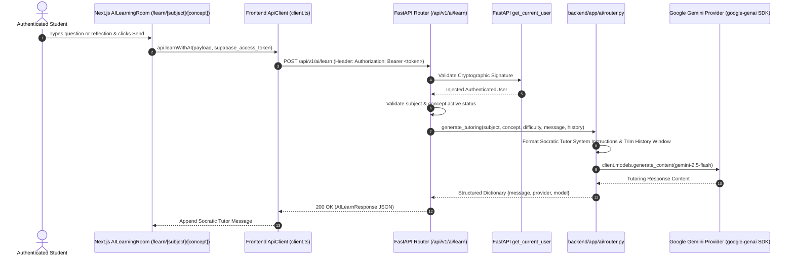

# PROOFLEARN AI Learning Room Architecture & Specification

## 1. User Experience & Learning Flow

The AI Learning Room allows an authenticated student to internalize concepts through interactive, Socratic dialogue with Google Gemini AI before practicing and entering Proof Mode.

---

## 2. AI Tutor System Prompt & Pedagogical Philosophy

The AI Learning Room is governed by the core PROOFLEARN philosophy: **"AI should help students learn, not replace their ability to think."**

### 2.1 Tutor Directives
- **Understand over Memorize**: Explains the *why* and *how* of the concept using mental models and analogies.
- **Socratic Comprehension Checks**: Concludes explanations with brief, thought-provoking questions to encourage active student participation.
- **Concise Examples**: Supplies targeted code or query snippets without dumping massive boilerplate.
- **Anti-Cheating Boundary**: Never performs full homework assignments for the student.
- **Verification Decoupling**: The tutor never awards grades, claims final mastery, or calculates Learning Evidence Index (LEI) scores.

---

## 3. Security & Boundary Rules

1. **Backend-Only Credentials**: The `GEMINI_API_KEY` exists strictly on the FastAPI backend. The frontend bundle and browser never receive or transmit AI provider secrets.
2. **Zero-Trust Identity**: Requests must include a valid Supabase JWT Bearer token. Any client-provided `user_id` inside request payloads is ignored.
3. **Payload Limits**: Student messages are constrained to a maximum of 4,000 characters to prevent prompt flooding and denial-of-service abuse.
4. **Context Window Control**: Conversation history sent to the model is capped at the most recent 10 in-memory dialogue turns to control latency and token costs.
5. **No Code Execution**: AI-generated code is rendered safely as read-only text without automated server-side or client-side execution.
6. **Task Boundary Notice**: This is **NORMAL LEARNING MODE**. Proof Mode, Practice Challenges, and LEI calculation are unlocked in subsequent tasks.
