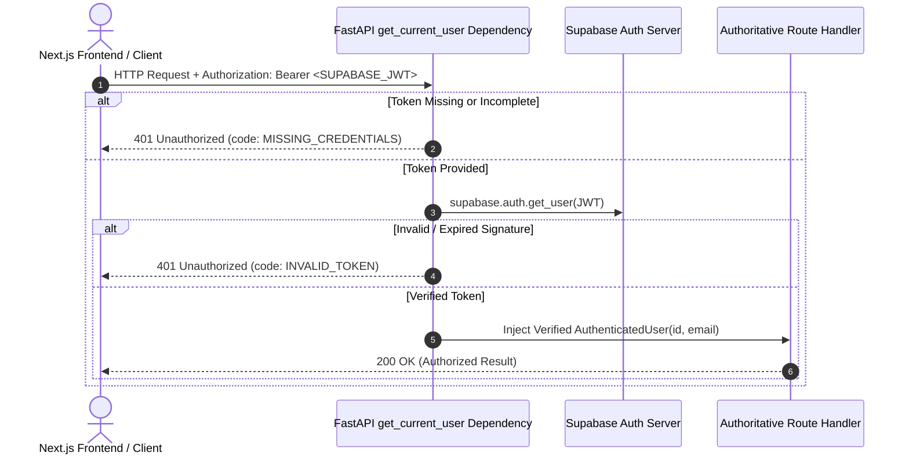

# PROOFLEARN REST API Architecture & Specification

## 1. Overview & Base Path

The PROOFLEARN backend is an authoritative Python FastAPI service responsible for executing secure, verified learning sessions, AI routing, server-locked Proof Mode evaluations, and Learning Evidence Index (LEI) calculations.

- **Base Namespace**: `/api/v1`
- **Protocol**: HTTP/1.1 & HTTP/2 over TLS (REST + JSON)
- **Content-Type**: `application/json`

---

## 2. API Conventions & Standard Response Envelopes

All API endpoints follow uniform JSON serialization conventions.

### 2.1 Standard Successful Response
```json
{
  "data": {
    "key": "value"
  },
  "meta": {
    "request_id": "8b0bd26a-02a4-4b12-a3ad-4187b7ff5fb6"
  }
}
```

### 2.2 Standard Error Response Envelope
```json
{
  "error": {
    "code": "VALIDATION_ERROR | UNAUTHORIZED | NOT_FOUND | INTERNAL_SERVER_ERROR",
    "message": "Human-readable error explanation.",
    "details": null
  }
}
```

---

## 3. Endpoints Implemented

### 3.1 Health Check
- **Route**: `GET /api/v1/health`
- **Auth**: Public (No authentication required)
- **Response**:
```json
{
  "status": "ok",
  "service": "prooflearn-api",
  "version": "0.1.0",
  "environment": "development"
}
```

### 3.2 Authenticated Identity Verification
- **Route**: `GET /api/v1/me`
- **Auth**: Required (`Authorization: Bearer <token>`)
- **Response**:
```json
{
  "id": "user-uuid-string",
  "email": "user@example.com",
  "authenticated": true,
  "display_name": "Learner",
  "avatar_url": "https://example.com/avatar.png"
}
```
- **Error**: Returns `401 Unauthorized` with `{"error": {"code": "MISSING_CREDENTIALS" | "INVALID_TOKEN", "message": "..."}}` if the token is missing or invalid.

### 3.3 Service Root & Legacy Health Probes
- `GET /`: Returns service identifier.
- `GET /health`: Backward-compatible infrastructure health check probe.

### 3.4 OpenAPI Documentation
- Interactive Swagger UI: `http://localhost:8000/docs`
- ReDoc UI: `http://localhost:8000/redoc`
- OpenAPI JSON Specification: `http://localhost:8000/openapi.json`

---

## 4. Authentication Architecture & Invariants



### 4.1 Zero-Trust Client Boundary Invariant
- **Rule**: Client-supplied `user_id` values in request bodies, query strings, or URL parameters are **NEVER trusted** for authorization.
- **Enforcement**: The authenticated user's UUID is strictly derived from the verified cryptographic JWT signature via `get_current_user`.

---

## 5. Middleware & Correlation

- **`RequestIdMiddleware`**: Intercepts every request and generates/echoes a unique `X-Request-ID` header.
- **CORS Configuration**: Restricts access to explicit trusted origins (`FRONTEND_URL` / `http://localhost:3000`). Wildcard origins (`allow_origins=["*"]`) are disabled.

---

## 6. Future Endpoint Map (Planned for Tasks 09–14)

| Endpoint Prefix | Responsibility | Task |
| :--- | :--- | :--- |
| `/api/v1/ai` | Socratic AI Router & message dispatch (Gemini) | Task 09–10 |
| `/api/v1/practice` | Formative practice evaluation & hints | Task 11 |
| `/api/v1/proof` | Server-locked PROOF MODE verification | Task 12 |
| `/api/v1/transfer` | Novel application challenge evaluation | Task 13 |
| `/api/v1/evidence` | LEI score computation & verifiable record issuance | Task 14 |
