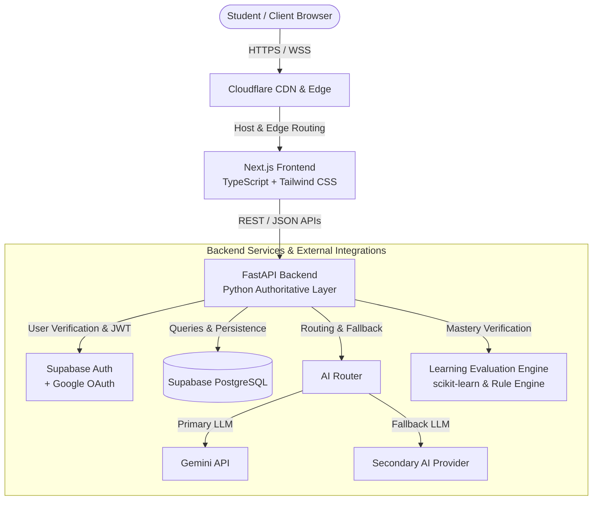
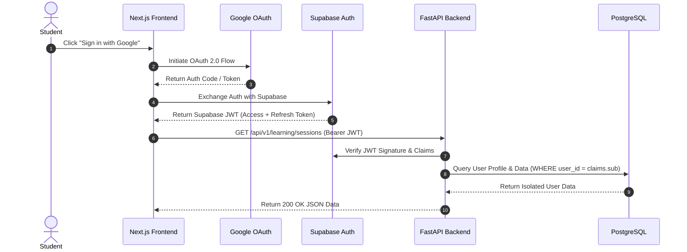
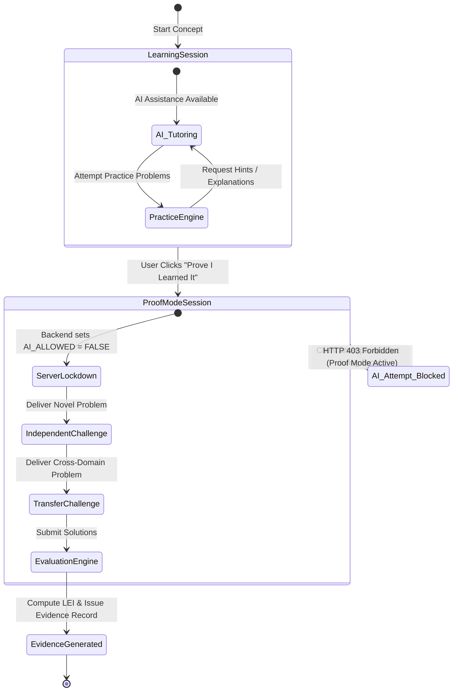

# PROOFLEARN Architecture Specification

## 1. System Overview

**PROOFLEARN** is an AI-powered learning verification SaaS platform built around the core philosophy:
> *"AI should help students learn, not replace their ability to think."*

The platform enables students to explore concepts with an interactive AI tutor, practice with contextual guidance, and prove mastery by entering **PROOF MODE**—a server-enforced assessment state where all AI assistance is severed server-side, challenging students to independently solve problems, pass transfer challenges, and generate verifiable **Learning Evidence**.

---

## 2. High-Level System Architecture

---

## 3. Core Component Responsibilities

### 3.1 Frontend Layer (Untrusted Client)
- **Technology**: Next.js (App Router), TypeScript, Tailwind CSS, shadcn/ui (Task 03).
- **Hosting**: Cloudflare Pages / Edge runtime.
- **Responsibilities**:
  - Render user interface, forms, code editors, and question views.
  - Client-side routing and optimistic navigation.
  - Present learning dialogues, practice challenges, proof challenges, and evidence certificates.
  - Consume backend REST APIs over HTTPS.
  - Maintain authenticated session state tokens securely.
- **Strict Constraints**:
  - Untrusted execution boundary: The client never calculates scores, evaluates proof mastery, or toggles Proof Mode.
  - Zero private secrets: Never hold Gemini keys, Supabase service-role keys, or internal evaluation weights.
  - Direct database access to PostgreSQL is strictly forbidden.

### 3.2 Backend Layer (Authoritative Application Layer)
- **Technology**: Python 3.14+, FastAPI, Uvicorn, Pydantic v2.
- **Responsibilities**:
  - Validate and authorize every incoming HTTP request.
  - Enforce server-side **PROOF MODE** state transitions and reject AI queries during active proof sessions.
  - Manage AI interactions through an abstracted AI Router with fallback resiliency.
  - Execute scoring, challenge generation, and Learning Evidence Index (LEI) calculations.
  - Handle database transactions and enforce user data isolation.
  - Sanitize all error messages and responses before returning to clients.

### 3.3 Database Layer (Supabase PostgreSQL)
- **Technology**: PostgreSQL managed via Supabase.
- **Responsibilities**:
  - Relational storage for subjects, concepts, sessions, attempts, evidence records, and logs.
  - Row Level Security (RLS) policies as an in-depth defensive layer.
  - Foreign key constraints ensuring transactional integrity between users, sessions, and attempts.

### 3.4 AI Router Layer
- **Technology**: Python Async Service.
- **Responsibilities**:
  - Standardize prompt formatting, token limits, temperature, and structured output parsing.
  - Route AI requests to Google Gemini (Primary) with automated fallback to secondary providers upon rate limits (429) or transient 5xx errors.
  - Strip sensitive headers and log prompt metadata safely without leaking user credentials.

### 3.5 Learning Evaluation Engine (LEE)
- **Technology**: Python, Pydantic, scikit-learn (for evaluation scoring and anomaly detection where applicable).
- **Responsibilities**:
  - Formulate non-deterministic transfer challenges based on previously solved concepts.
  - Compute multi-dimensional mastery scores (Recall, Explanation, Application, Transfer, Independence).
  - Generate the Learning Evidence Index (LEI).

---

## 4. Authentication & Authorization Flow

- **Identity Provider**: Google OAuth handles user authentication.
- **Auth Broker**: Supabase Auth handles token issuance and session lifecycle.
- **Authorization**: FastAPI validates the cryptographic signature and expiration of the JWT, extracting the unique `user_id` (`sub` claim) for multi-tenant data isolation.

---

## 5. PROOF MODE Security & Execution Architecture

**PROOF MODE** is the platform's signature integrity mechanism. The diagram below details the server-side lockdown:

### Server-Enforced Invariants
1. When a student initiates Proof Mode, the backend creates a `proof_session` record in state `IN_PROGRESS` and sets `ai_allowed = FALSE`.
2. Any request to the AI Router referencing this session or user during an active proof session is immediately rejected with `403 Forbidden: Proof Mode Active`.
3. Proof challenges are delivered server-side with randomized parameterization to prevent hardcoded answer replay.
4. Solutions must be evaluated entirely server-side.

---

## 6. End-to-End Learning & Verification Data Flow

```mermaid
flowchart LR
    A[Subject Selection\ne.g., Python / SQL] --> B[Concept Selection\ne.g., Recursion]
    B --> C[AI Learning Room\nInteractive Explanation]
    C --> D[Practice Mode\nGuided Feedback]
    D --> E[PROOF MODE\nServer-Side AI Severed]
    E --> F[Independent Challenge\nSolo Problem Solving]
    F --> G[Transfer Challenge\nNovel Context Application]
    G --> H[Learning Evidence Index\nLEI 0-100 Score]
    H --> I[Learning History\nVerifiable Record Ledger]
```

---

## 7. Technology Stack Summary

| Layer | Technology | Primary Function |
| :--- | :--- | :--- |
| **Frontend Web** | Next.js 16+ (App Router) + TypeScript | Responsive UI, client routing, state management |
| **Styling & UI** | Tailwind CSS v4 + shadcn/ui | Premium dark-mode UI and accessible components |
| **Backend API** | Python 3.14+ / FastAPI / Uvicorn | Authoritative business logic, validation, security |
| **Database & Auth** | Supabase PostgreSQL + Supabase Auth | Persistence, relational schemas, user sessions |
| **Identity Provider**| Google OAuth 2.0 | Single Sign-On identity provider |
| **AI Integration** | Google Gemini API (via FastAPI AI Router) | Interactive tutoring, dynamic hints, challenges |
| **Evaluation / ML** | Python + scikit-learn | LEI scoring models and rubric evaluation |
| **Testing** | pytest (backend) + Playwright (E2E) | Unit, integration, and end-to-end verification |
| **Edge / CDN** | Cloudflare Pages & DNS | Edge caching, DDoS protection, global delivery |
