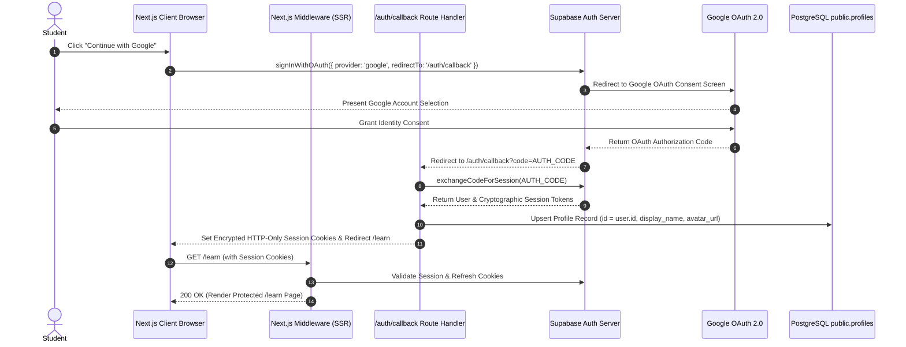

# PROOFLEARN Authentication Specification: Google OAuth + Supabase Auth

## 1. Authentication Architecture

PROOFLEARN integrates **Google OAuth 2.0** as the primary Single Sign-On (SSO) identity provider via **Supabase Auth**, employing cookie-based server-side session management (`@supabase/ssr`) in the Next.js App Router.



---

## 2. Component Implementation Summary

### 2.1 Supabase SSR Client Architecture
- **Browser Client** ([frontend/src/lib/supabase/client.ts](file:///c:/Users/varap/Downloads/PROOFLEARN/frontend/src/lib/supabase/client.ts)):
  - Uses `createBrowserClient` from `@supabase/ssr`.
  - Used in client components for initiating OAuth flows (`signInWithOAuth`).
- **Server Client** ([frontend/src/lib/supabase/server.ts](file:///c:/Users/varap/Downloads/PROOFLEARN/frontend/src/lib/supabase/server.ts)):
  - Uses `createServerClient` from `@supabase/ssr` coupled with `next/headers` `cookies()`.
  - Used in Server Components, Route Handlers, and Server Actions for authoritative session validation.
- **Session Middleware** ([frontend/src/middleware.ts](file:///c:/Users/varap/Downloads/PROOFLEARN/frontend/src/middleware.ts)):
  - Refreshes auth tokens on every matched request and handles route protection.

### 2.2 OAuth Callback & Safe Redirects
- Location: [frontend/src/app/auth/callback/route.ts](file:///c:/Users/varap/Downloads/PROOFLEARN/frontend/src/app/auth/callback/route.ts)
- **Open-Redirect Protection**: The `redirectTo` query parameter is strictly validated (`startsWith('/') && !startsWith('//')`). Arbitrary external domain redirects are rejected.
- **Profile Synchronization**: Automatically creates or updates the student's row in `public.profiles` with `id = auth.users.id`.

### 2.3 Sign-In & Authenticated Views
- **Sign-In Page** ([frontend/src/app/auth/sign-in/page.tsx](file:///c:/Users/varap/Downloads/PROOFLEARN/frontend/src/app/auth/sign-in/page.tsx)):
  - Implements the Task 03 design system with accessible Google button, loading spinner, and user-friendly error alerts.
- **Protected Verification Route** ([frontend/src/app/learn/page.tsx](file:///c:/Users/varap/Downloads/PROOFLEARN/frontend/src/app/learn/page.tsx)):
  - Verifies `supabase.auth.getUser()` on the server.
  - Displays authenticated user profile details, active session confirmation, and a server-action logout button.

---

## 3. Environment Variables Configuration

### 3.1 Public Variables (Safe for Browser)
| Variable | Scope | Description |
| :--- | :--- | :--- |
| `NEXT_PUBLIC_SUPABASE_URL` | Client + Server | URL of your Supabase project (e.g., `https://xyzcompany.supabase.co`). |
| `NEXT_PUBLIC_SUPABASE_ANON_KEY` | Client + Server | Public anon key for anonymous/authenticated client requests. |
| `NEXT_PUBLIC_API_URL` | Client + Server | Backend FastAPI local URL (`http://localhost:8000`). |

### 3.2 Secret Variables (NEVER Expose to Client or Git)
| Variable | Location | Description |
| :--- | :--- | :--- |
| `Google OAuth Client Secret` | Supabase Dashboard Only | Provided by Google Cloud Console. |
| `SUPABASE_SERVICE_ROLE_KEY` | Backend Server Env Only | Full administrative database key. |

---

## 4. Setup Guide: Google Cloud & Supabase Dashboard

### Step 1: Google Cloud Console Setup
1. Navigate to the [Google Cloud Console](https://console.cloud.google.com/).
2. Create or select your Google Cloud Project.
3. Go to **APIs & Services** > **OAuth consent screen**:
   - User Type: **External**
   - App Name: `PROOFLEARN`
   - User support email: Select your email
   - Scopes: `.../auth/userinfo.email`, `.../auth/userinfo.profile`, `openid` (Default basic scopes).
4. Go to **APIs & Services** > **Credentials**:
   - Click **Create Credentials** > **OAuth client ID**.
   - Application type: **Web application**.
   - Name: `PROOFLEARN Web Client`.
   - **Authorized JavaScript origins**:
     - `http://localhost:3000`
     - `https://<YOUR_SUPABASE_PROJECT_ID>.supabase.co`
   - **Authorized redirect URIs**:
     - `https://<YOUR_SUPABASE_PROJECT_ID>.supabase.co/auth/v1/callback`
5. Copy the generated **Client ID** and **Client Secret**.

### Step 2: Supabase Dashboard Setup
1. Open your project on the [Supabase Dashboard](https://supabase.com/dashboard).
2. Go to **Authentication** > **Providers** > **Google**:
   - Toggle **Enable Google provider**: `ON`.
   - Enter the **Client ID** and **Client Secret** from Step 1.
   - Click **Save**.
3. Go to **Authentication** > **URL Configuration**:
   - **Site URL**: `http://localhost:3000`
   - **Redirect URLs**:
     - `http://localhost:3000/auth/callback`
     - `http://127.0.0.1:3000/auth/callback`

### Step 3: Local Environment Setup
Create `frontend/.env.local` with your project keys:
```bash
NEXT_PUBLIC_SUPABASE_URL=https://<YOUR_SUPABASE_PROJECT_ID>.supabase.co
NEXT_PUBLIC_SUPABASE_ANON_KEY=<YOUR_SUPABASE_ANON_KEY>
NEXT_PUBLIC_API_URL=http://localhost:8000
```

---

## 5. Security Invariants

1. **Server-Side Session Verification**: Route authorization never relies on client-side state or cookies parsed insecurely in JavaScript.
2. **Minimal OAuth Scopes**: Only identity information (`email`, `profile`, `openid`) is requested; no Google Drive or calendar permissions.
3. **No Secret Leaks**: Neither Google Client Secret nor Supabase Service Role keys exist in frontend code or client bundles.
4. **Row Level Security (RLS)**: Enforces `auth.uid() = id` on all table queries.
