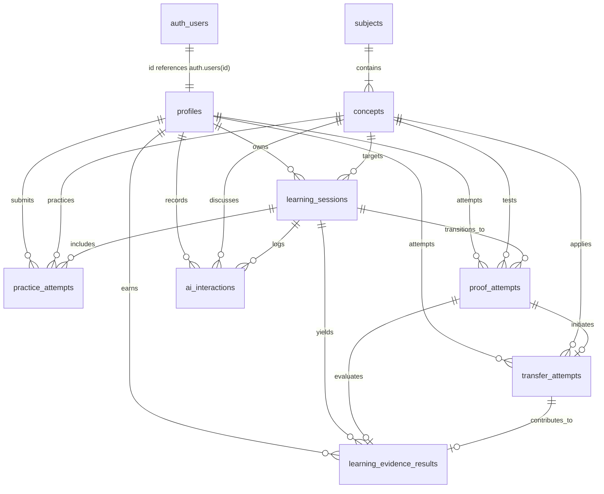

# PROOFLEARN Database Schema & Data Layer Specification

## 1. Overview & Architecture

The PROOFLEARN persistence layer is built on **PostgreSQL** hosted via **Supabase**. The database models the verified learning journey: from guided AI study to server-enforced **PROOF MODE**, transfer verification, and tamper-evident **Learning Evidence**.

---

## 2. Entity-Relationship Diagram



---

## 3. Relational Tables Specification

### 3.1 `public.profiles`
Represents application-level user profile metadata synchronized from `auth.users`.

| Column | Type | Constraints | Description |
| :--- | :--- | :--- | :--- |
| `id` | `UUID` | `PRIMARY KEY`, `REFERENCES auth.users(id) ON DELETE CASCADE` | Matches Supabase Auth user ID. |
| `display_name` | `TEXT` | Nullable | Public student handle / name. |
| `avatar_url` | `TEXT` | Nullable | Profile avatar image link. |
| `created_at` | `TIMESTAMPTZ` | `NOT NULL DEFAULT NOW()` | Record creation timestamp. |
| `updated_at` | `TIMESTAMPTZ` | `NOT NULL DEFAULT NOW()` | Record update timestamp. |

---

### 3.2 `public.subjects`
Curriculum disciplines available in PROOFLEARN.

| Column | Type | Constraints | Description |
| :--- | :--- | :--- | :--- |
| `id` | `UUID` | `PRIMARY KEY DEFAULT gen_random_uuid()` | Unique subject identifier. |
| `name` | `TEXT` | `NOT NULL` | Display name (e.g., "Python", "SQL"). |
| `slug` | `TEXT` | `NOT NULL UNIQUE` | URL-safe slug (e.g., `python`, `sql`). |
| `description` | `TEXT` | Nullable | Subject scope and overview. |
| `is_active` | `BOOLEAN` | `NOT NULL DEFAULT TRUE` | Active visibility flag. |
| `created_at` | `TIMESTAMPTZ` | `NOT NULL DEFAULT NOW()` | Record creation timestamp. |
| `updated_at` | `TIMESTAMPTZ` | `NOT NULL DEFAULT NOW()` | Record update timestamp. |

---

### 3.3 `public.concepts`
Modular topic units belonging to a specific subject.

| Column | Type | Constraints | Description |
| :--- | :--- | :--- | :--- |
| `id` | `UUID` | `PRIMARY KEY DEFAULT gen_random_uuid()` | Unique concept identifier. |
| `subject_id` | `UUID` | `NOT NULL REFERENCES subjects(id) ON DELETE CASCADE` | Foreign key to parent subject. |
| `name` | `TEXT` | `NOT NULL` | Topic name (e.g., "Functions"). |
| `slug` | `TEXT` | `NOT NULL` | URL slug within subject namespace. |
| `description` | `TEXT` | Nullable | Conceptual explanation. |
| `difficulty` | `TEXT` | `NOT NULL CHECK (difficulty IN ('beginner', 'intermediate', 'advanced'))` | Difficulty tier. |
| `is_active` | `BOOLEAN` | `NOT NULL DEFAULT TRUE` | Active visibility flag. |
| `created_at` | `TIMESTAMPTZ` | `NOT NULL DEFAULT NOW()` | Record creation timestamp. |
| `updated_at` | `TIMESTAMPTZ` | `NOT NULL DEFAULT NOW()` | Record update timestamp. |

*Table Constraint*: `UNIQUE (subject_id, slug)`

---

### 3.4 `public.learning_sessions`
Tracks active and completed learning engagements.

| Column | Type | Constraints | Description |
| :--- | :--- | :--- | :--- |
| `id` | `UUID` | `PRIMARY KEY DEFAULT gen_random_uuid()` | Unique session ID. |
| `user_id` | `UUID` | `NOT NULL REFERENCES profiles(id) ON DELETE CASCADE` | Owning student ID. |
| `concept_id` | `UUID` | `NOT NULL REFERENCES concepts(id) ON DELETE CASCADE` | Target learning concept. |
| `started_at` | `TIMESTAMPTZ` | `NOT NULL DEFAULT NOW()` | Session start timestamp. |
| `ended_at` | `TIMESTAMPTZ` | Nullable | Session conclusion timestamp. |
| `status` | `TEXT` | `NOT NULL DEFAULT 'active' CHECK (status IN ('active', 'completed', 'abandoned'))` | Session state. |
| `created_at` | `TIMESTAMPTZ` | `NOT NULL DEFAULT NOW()` | Record creation timestamp. |
| `updated_at` | `TIMESTAMPTZ` | `NOT NULL DEFAULT NOW()` | Record update timestamp. |

---

### 3.5 `public.practice_attempts`
Guided practice problems attempted before entering Proof Mode.

| Column | Type | Constraints | Description |
| :--- | :--- | :--- | :--- |
| `id` | `UUID` | `PRIMARY KEY DEFAULT gen_random_uuid()` | Unique attempt ID. |
| `user_id` | `UUID` | `NOT NULL REFERENCES profiles(id) ON DELETE CASCADE` | Owning student ID. |
| `session_id` | `UUID` | `NOT NULL REFERENCES learning_sessions(id) ON DELETE CASCADE` | Associated learning session. |
| `concept_id` | `UUID` | `NOT NULL REFERENCES concepts(id) ON DELETE CASCADE` | Associated concept. |
| `question_type` | `TEXT` | `NOT NULL` | Format (e.g., `code`, `mcq`, `explanation`). |
| `question_text` | `TEXT` | `NOT NULL` | Problem statement. |
| `student_answer` | `TEXT` | Nullable | Student response / code. |
| `is_correct` | `BOOLEAN` | Nullable | Verification result. |
| `score` | `NUMERIC(5,2)` | `CHECK (score IS NULL OR (score >= 0 AND score <= 100))` | Practice grade percentage. |
| `feedback` | `TEXT` | Nullable | Automated / tutor guidance feedback. |
| `created_at` | `TIMESTAMPTZ` | `NOT NULL DEFAULT NOW()` | Submission timestamp. |

---

### 3.6 `public.proof_attempts`
Authoritative independent problem solving executed in server-locked **PROOF MODE**.

| Column | Type | Constraints | Description |
| :--- | :--- | :--- | :--- |
| `id` | `UUID` | `PRIMARY KEY DEFAULT gen_random_uuid()` | Unique proof attempt ID. |
| `user_id` | `UUID` | `NOT NULL REFERENCES profiles(id) ON DELETE CASCADE` | Owning student ID. |
| `session_id` | `UUID` | `NOT NULL REFERENCES learning_sessions(id) ON DELETE CASCADE` | Associated learning session. |
| `concept_id` | `UUID` | `NOT NULL REFERENCES concepts(id) ON DELETE CASCADE` | Tested concept. |
| `prompt` | `TEXT` | `NOT NULL` | Server-generated independent challenge. |
| `student_answer` | `TEXT` | Nullable | Student solo code / solution. |
| `explanation` | `TEXT` | Nullable | Student conceptual explanation. |
| `started_at` | `TIMESTAMPTZ` | `NOT NULL DEFAULT NOW()` | Challenge start timestamp. |
| `submitted_at` | `TIMESTAMPTZ` | Nullable | Submission timestamp. |
| `status` | `TEXT` | `NOT NULL DEFAULT 'started' CHECK (status IN ('started', 'submitted', 'evaluated'))` | Proof attempt status. |
| `created_at` | `TIMESTAMPTZ` | `NOT NULL DEFAULT NOW()` | Record creation timestamp. |

---

### 3.7 `public.transfer_attempts`
Cross-domain application challenges testing conceptual generalization.

| Column | Type | Constraints | Description |
| :--- | :--- | :--- | :--- |
| `id` | `UUID` | `PRIMARY KEY DEFAULT gen_random_uuid()` | Unique transfer attempt ID. |
| `user_id` | `UUID` | `NOT NULL REFERENCES profiles(id) ON DELETE CASCADE` | Owning student ID. |
| `proof_attempt_id` | `UUID` | `NOT NULL REFERENCES proof_attempts(id) ON DELETE CASCADE` | Linked independent proof attempt. |
| `concept_id` | `UUID` | `NOT NULL REFERENCES concepts(id) ON DELETE CASCADE` | Tested concept. |
| `challenge_prompt` | `TEXT` | `NOT NULL` | Novel context transfer challenge. |
| `student_answer` | `TEXT` | Nullable | Student solution. |
| `score` | `NUMERIC(5,2)` | `CHECK (score IS NULL OR (score >= 0 AND score <= 100))` | Transfer mastery grade. |
| `evaluation_notes` | `TEXT` | Nullable | Evaluation rubric notes. |
| `created_at` | `TIMESTAMPTZ` | `NOT NULL DEFAULT NOW()` | Submission timestamp. |

---

### 3.8 `public.ai_interactions`
Audit log of tutoring dialogues during standard learning sessions (severed during Proof Mode).

| Column | Type | Constraints | Description |
| :--- | :--- | :--- | :--- |
| `id` | `UUID` | `PRIMARY KEY DEFAULT gen_random_uuid()` | Unique interaction ID. |
| `user_id` | `UUID` | `NOT NULL REFERENCES profiles(id) ON DELETE CASCADE` | Owning student ID. |
| `session_id` | `UUID` | `NOT NULL REFERENCES learning_sessions(id) ON DELETE CASCADE` | Associated learning session. |
| `concept_id` | `UUID` | `NOT NULL REFERENCES concepts(id) ON DELETE CASCADE` | Active concept. |
| `provider` | `TEXT` | `NOT NULL CHECK (provider IN ('gemini', 'fallback'))` | AI model provider. |
| `model` | `TEXT` | `NOT NULL` | Model identifier string (e.g. `gemini-1.5-pro`). |
| `request_type` | `TEXT` | `NOT NULL` | Purpose (e.g., `tutoring`, `hint`). |
| `user_message` | `TEXT` | `NOT NULL` | Student prompt text. |
| `assistant_response`| `TEXT` | `NOT NULL` | AI tutor response text. |
| `created_at` | `TIMESTAMPTZ` | `NOT NULL DEFAULT NOW()` | Interaction timestamp. |

---

### 3.9 `public.learning_evidence_results`
Verifiable evidence records issued upon evaluating Proof Mode and Transfer attempts.

| Column | Type | Constraints | Description |
| :--- | :--- | :--- | :--- |
| `id` | `UUID` | `PRIMARY KEY DEFAULT gen_random_uuid()` | Unique evidence record ID. |
| `user_id` | `UUID` | `NOT NULL REFERENCES profiles(id) ON DELETE CASCADE` | Owning student ID. |
| `session_id` | `UUID` | `NOT NULL REFERENCES learning_sessions(id) ON DELETE CASCADE` | Linked learning session. |
| `proof_attempt_id` | `UUID` | `NOT NULL REFERENCES proof_attempts(id) ON DELETE CASCADE` | Linked proof attempt. |
| `transfer_attempt_id` | `UUID` | `REFERENCES transfer_attempts(id) ON DELETE SET NULL` | Linked transfer attempt. |
| `recall_score` | `NUMERIC(5,2)` | `0.00 – 100.00` | Recall mastery subscore. |
| `explanation_score` | `NUMERIC(5,2)` | `0.00 – 100.00` | Explanation mastery subscore. |
| `application_score` | `NUMERIC(5,2)` | `0.00 – 100.00` | Application mastery subscore. |
| `transfer_score` | `NUMERIC(5,2)` | `0.00 – 100.00` | Transfer mastery subscore. |
| `independence_score`| `NUMERIC(5,2)` | `0.00 – 100.00` | Independence mastery subscore. |
| `ai_dependency_score`| `NUMERIC(5,2)`| `0.00 – 100.00` | AI dependency ratio score. |
| `lei_score` | `NUMERIC(5,2)` | `0.00 – 100.00` | **Learning Evidence Index**. |
| `interpretation` | `TEXT` | Nullable | Qualitative assessment narrative. |
| `created_at` | `TIMESTAMPTZ` | `NOT NULL DEFAULT NOW()` | Issue timestamp. |

> **Disclaimer**: *The Learning Evidence Index (LEI) is a product prototype educational metric reflecting mastery evidence across multi-dimensional criteria. It is NOT an IQ score or psychological diagnosis.*

---

## 4. Row Level Security (RLS) Policies

All tables enforce PostgreSQL Row Level Security:
- **`subjects` & `concepts`**: Publicly readable (`SELECT is_active = TRUE`), write-restricted to administrative service roles.
- **`profiles`**: Authenticated users can view, insert, and update only their own profile (`auth.uid() = id`).
- **`learning_sessions`, `practice_attempts`, `proof_attempts`, `transfer_attempts`, `ai_interactions`, `learning_evidence_results`**: Authenticated users have scoped access only to rows where `auth.uid() = user_id`.

---

## 5. Seed Dataset (MVP Curriculum)

| Subject | Slug | Seed Concepts | Difficulty |
| :--- | :--- | :--- | :--- |
| **Python** | `python` | 1. Variables & Data Types<br>2. Functions<br>3. Lists & Dictionaries | Beginner<br>Beginner<br>Intermediate |
| **Java** | `java` | 1. Variables & Data Types<br>2. Methods<br>3. OOP Basics | Beginner<br>Beginner<br>Intermediate |
| **SQL** | `sql` | 1. SELECT & Filtering<br>2. JOINs<br>3. Aggregations & GROUP BY | Beginner<br>Intermediate<br>Intermediate |
| **AI & Machine Learning** | `ai-ml` | 1. Supervised Learning<br>2. Train/Test Split<br>3. Classification Basics | Beginner<br>Beginner<br>Intermediate |
| **Data Science** | `data-science`| 1. Data Cleaning<br>2. Exploratory Data Analysis<br>3. Feature Understanding | Beginner<br>Intermediate<br>Intermediate |

---

## 6. Migration Application Instructions

To apply these migrations against your Supabase project:
1. Connect via Supabase CLI:
   ```bash
   supabase db push
   ```
2. Or execute via the Supabase Dashboard SQL Editor in numerical order:
   - [supabase/migrations/20260823000001_initial_schema.sql](file:///c:/Users/varap/Downloads/PROOFLEARN/supabase/migrations/20260823000001_initial_schema.sql)
   - [supabase/migrations/20260823000002_seed_data.sql](file:///c:/Users/varap/Downloads/PROOFLEARN/supabase/migrations/20260823000002_seed_data.sql)
