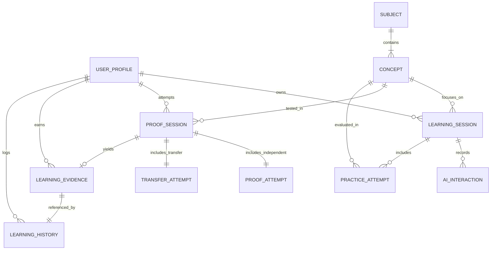

# PROOFLEARN Domain Model Specification

> **Note**: This document defines the conceptual entities, attributes, relationships, and invariants for PROOFLEARN. Database schemas, migrations, and ORM models will be implemented in a subsequent database task.

---

## 1. Conceptual Entity-Relationship Diagram

---

## 2. Core Domain Entities

### 2.1 User Profile (`user_profiles`)
- **Purpose**: Represents the registered student identity synchronized with Supabase Auth / Google OAuth.
- **Key Fields**:
  - `id` (UUID): Primary key matching `auth.users.id`.
  - `email` (String): Verified email address from Google.
  - `display_name` (String): Student public handle/name.
  - `avatar_url` (String, optional): Profile image URL.
  - `created_at` / `updated_at` (Timestamps).
- **Ownership & Security**: Owned by the authenticated user. Accessible only by self or system administrators.

### 2.2 Subject (`subjects`)
- **Purpose**: High-level learning discipline in the MVP curriculum.
- **Initial MVP Subjects**:
  1. Python Programming
  2. Java Programming
  3. SQL & Relational Databases
  4. AI & Machine Learning
  5. Data Science & Analytics
- **Key Fields**:
  - `id` (Slug/UUID): e.g. `python`, `sql`.
  - `name` (String): Display title.
  - `description` (Text): Subject scope.
  - `order_index` (Integer): Sorting sequence.
- **Ownership & Security**: Global read-only reference data.

### 2.3 Concept (`concepts`)
- **Purpose**: Granular modular learning topic within a subject (e.g., *Recursion*, *Window Functions*, *Gradient Descent*).
- **Key Fields**:
  - `id` (Slug/UUID): e.g. `python-recursion`.
  - `subject_id` (UUID): Foreign key to `subjects`.
  - `title` (String): Concept title.
  - `description` (Text): Detailed explanation of topic.
  - `difficulty_level` (Enum): `BEGINNER`, `INTERMEDIATE`, `ADVANCED`.
  - `prerequisites` (Array of Concept IDs).
- **Ownership & Security**: Global read-only reference data.

### 2.4 Learning Session (`learning_sessions`)
- **Purpose**: Tracks a student's active interactive learning engagement with the AI Tutor for a concept.
- **Key Fields**:
  - `id` (UUID): Primary Key.
  - `user_id` (UUID): Foreign key to `user_profiles`.
  - `concept_id` (UUID): Foreign key to `concepts`.
  - `status` (Enum): `ACTIVE`, `COMPLETED`, `ABANDONED`.
  - `started_at` / `completed_at` (Timestamps).
- **Ownership & Security**: Strictly private to the owning user.

### 2.5 AI Interaction (`ai_interactions`)
- **Purpose**: Audit record of messages exchanged between the student and AI Tutor during learning.
- **Key Fields**:
  - `id` (UUID): Primary Key.
  - `session_id` (UUID): Foreign key to `learning_sessions`.
  - `user_id` (UUID): Foreign key to `user_profiles`.
  - `role` (Enum): `USER`, `ASSISTANT`, `SYSTEM`.
  - `content` (Text): Message text.
  - `token_count` (Integer): Usage tracking for rate-limiting.
  - `timestamp` (Timestamp).
- **Ownership & Security**: Strictly private to the owning user. Never exposed during Proof Mode.

### 2.6 Practice Attempt (`practice_attempts`)
- **Purpose**: Records student attempts on guided practice problems before entering Proof Mode.
- **Key Fields**:
  - `id` (UUID): Primary Key.
  - `session_id` (UUID): Foreign key to `learning_sessions`.
  - `concept_id` (UUID): Foreign key to `concepts`.
  - `problem_prompt` (Text): Problem statement.
  - `solution_submitted` (Text): Student code or answer.
  - `passed` (Boolean): Validation outcome.
  - `hints_requested` (Integer): Count of AI hints consumed.
- **Ownership & Security**: Private to user.

### 2.7 Proof Session (`proof_sessions`)
- **Purpose**: **The Authoritative PROOF MODE Session**. Governs server-side lockdown.
- **Key Fields**:
  - `id` (UUID): Primary Key.
  - `user_id` (UUID): Foreign key to `user_profiles`.
  - `concept_id` (UUID): Foreign key to `concepts`.
  - `ai_allowed` (Boolean): **Strictly FALSE** during active session.
  - `status` (Enum): `INITIALIZED`, `IN_PROGRESS`, `SUBMITTED`, `VERIFIED`, `FAILED`.
  - `started_at` / `submitted_at` (Timestamps).
- **Ownership & Security**: Server-enforced invariant: `ai_allowed == False`. Rejects all AI proxy requests.

### 2.8 Proof Attempt (`proof_attempts`)
- **Purpose**: The independent problem-solving submission completed during Proof Mode without AI.
- **Key Fields**:
  - `id` (UUID): Primary Key.
  - `proof_session_id` (UUID): Foreign key to `proof_sessions`.
  - `challenge_payload` (JSON): Server-generated randomized challenge.
  - `submitted_code` (Text): Student independent solution.
  - `test_results` (JSON): Server test suite outputs.
  - `score` (Float): 0.0 - 100.0.
- **Ownership & Security**: Evaluated solely by server-side test runner.

### 2.9 Transfer Attempt (`transfer_attempts`)
- **Purpose**: The novel transfer challenge evaluating cross-domain application of the concept.
- **Key Fields**:
  - `id` (UUID): Primary Key.
  - `proof_session_id` (UUID): Foreign key to `proof_sessions`.
  - `transfer_domain` (String): e.g. "Finance", "Biology".
  - `challenge_payload` (JSON): Novel problem applying same underlying concept.
  - `submitted_code` (Text): Student solution.
  - `test_results` (JSON): Server evaluation outcome.
  - `score` (Float): 0.0 - 100.0.
- **Ownership & Security**: Evaluated solely server-side.

### 2.10 Learning Evidence (`learning_evidence`)
- **Purpose**: The verifiable mastery record generated upon successful completion of Proof Mode.
- **Key Fields**:
  - `id` (UUID): Primary Key.
  - `proof_session_id` (UUID): Foreign key to `proof_sessions`.
  - `user_id` (UUID): Foreign key to `user_profiles`.
  - `concept_id` (UUID): Foreign key to `concepts`.
  - `lei_score` (Float): **Learning Evidence Index (0 - 100)**.
  - `metrics` (JSON): Component breakdowns (Recall, Explanation, Application, Transfer, Independence).
  - `verification_hash` (String): Cryptographic tamper-evident signature of proof payload.
  - `issued_at` (Timestamp).
- **Ownership & Security**: Publicly verifiable record if shared by user; generated strictly server-side.

### 2.11 Learning History (`learning_history`)
- **Purpose**: Chronological student mastery ledger aggregating evidence, progress milestones, and trends over time.
- **Key Fields**:
  - `id` (UUID): Primary Key.
  - `user_id` (UUID): Foreign key to `user_profiles`.
  - `evidence_id` (UUID, optional): Reference to earned evidence.
  - `event_type` (Enum): `CONCEPT_STARTED`, `PRACTICE_COMPLETED`, `PROOF_PASSED`, `EVIDENCE_ISSUED`.
  - `created_at` (Timestamp).
- **Ownership & Security**: Private student timeline.
