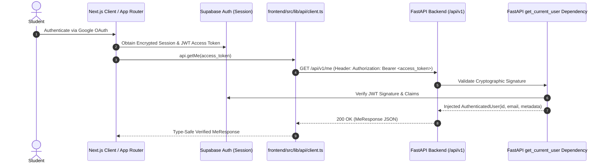

# PROOFLEARN Frontend ↔ FastAPI Integration Guide

## 1. Integration Architecture

The Next.js frontend communicates with the authoritative FastAPI backend over REST/JSON using Bearer JWT authentication sourced directly from Supabase Auth.



---

## 2. Centralized Frontend API Client

The frontend interacts with the backend strictly through [`frontend/src/lib/api/client.ts`](file:///c:/Users/varap/Downloads/PROOFLEARN/frontend/src/lib/api/client.ts). Component code does NOT make raw, scattered `fetch()` calls.

### 2.1 Configuration
- Base URL is derived from `NEXT_PUBLIC_API_BASE_URL` (or `NEXT_PUBLIC_API_URL`).
- Default: `http://localhost:8000`.

### 2.2 Client Capabilities
- **Generic Typed Methods**: `get<T>`, `post<T>`, `put<T>`, `delete<T>`.
- **Request Timeout**: Handled cleanly via `AbortController` with normalized `REQUEST_TIMEOUT` error.
- **Error Normalization**: Maps non-2xx responses into structured `ApiError` instances containing code, status, message, and details without leaking stack traces or internal secrets.
- **Header & Token Security**: Injects `Authorization: Bearer <token>` when supplied without persisting tokens in client state or URLs.

---

## 3. Endpoints Implemented

### 3.1 Public Health Check
- **Endpoint**: `GET /api/v1/health`
- **Authentication**: None (Public)
- **Response**:
```json
{
  "status": "ok",
  "service": "prooflearn-api",
  "version": "0.1.0",
  "environment": "development"
}
```

### 3.2 Authenticated Identity Check
- **Endpoint**: `GET /api/v1/me`
- **Authentication**: Required (`Authorization: Bearer <supabase_access_token>`)
- **Response**:
```json
{
  "id": "c1a2b3c4-d5e6-7f8a-9b0c-1d2e3f4a5b6c",
  "email": "student@prooflearn.app",
  "authenticated": true,
  "display_name": "Student",
  "avatar_url": null
}
```

---

## 4. Security & Boundary Rules

1. **Zero Client Trust**: FastAPI derives the user's UUID strictly from the verified JWT signature. Any `user_id` query parameter or body property sent by the client is discarded.
2. **CORS Policy**: Configured strictly to allow only verified origins (`FRONTEND_URL`). Wildcards (`*`) are disallowed.
3. **No Secrets in Frontend**: Private server keys (`SUPABASE_SERVICE_ROLE_KEY`, `GOOGLE_CLIENT_SECRET`) are never included in Next.js bundles or environment variables.
