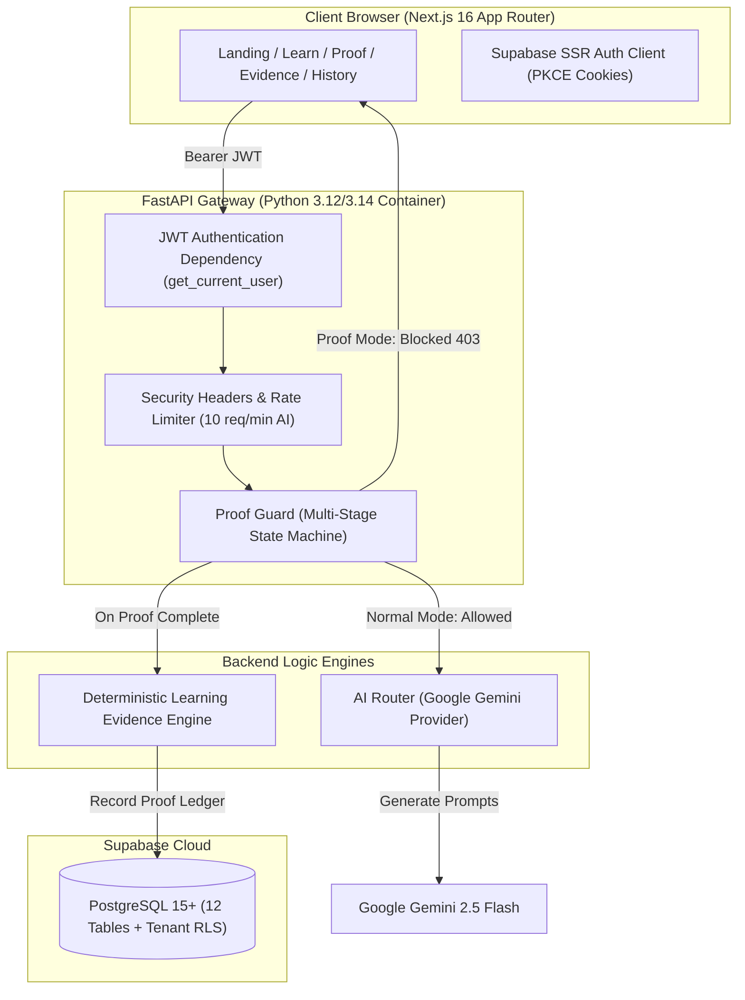

# PROOFLEARN Hackathon Demo Guide & Presentation Script

> **"Don't just get the answer. Prove you learned it."**

---

## 1. Demo Objective & Executive Hook

**Problem Statement**:
> *"Students today can prompt generative AI to output correct homework solutions in seconds. But a correct AI-generated answer does not prove that the student understands the concept. Reading an AI response creates an illusion of competence that collapses the moment AI is unavailable."*

**The PROOFLEARN Innovation**:
PROOFLEARN is the first learning verification platform that explicitly separates **AI-assisted learning** from **AI-independent demonstration**. Students learn with a Socratic AI tutor, practice with formative guidance, and enter **PROOF MODE**—a server-enforced assessment boundary where AI access is severed—to solve independent challenges, complete novel transfer scenarios, and generate an objective **Learning Evidence Index (LEI)** recorded in a private, verifiable ledger.

---

## 2. Selected Demo Concept & Setup

- **Demo Subject**: **Python** (`python`)
- **Demo Concept**: **Functions** (`functions`)
- **Why Selected**:
  1. Universally understood core software engineering concept.
  2. Demonstrates Socratic AI interaction clearly (parameters, return values, variable scope).
  3. Features a structured formative practice question.
  4. Features a clear Independent Challenge (*Modular Discount Calculator Design*).
  5. Features a vivid, real-world Transfer Challenge (*Agricultural IoT Greenhouse Telemetry*).
  6. Produces rich, transparent LEI dimension signals ($0.0 - 100.0$).
  7. Clearly proves server-enforced AI lockout.

---

## 3. Live 3–5 Minute Presentation Script

### [0:00 - 0:30] Hook & Problem
> *"Judges, imagine asking ChatGPT to write a Python script for your class. You get the code, paste it into your assignment, and get an A. But did you actually learn anything? When you sit in a technical interview without AI, what happens?*
> 
> *The fundamental flaw with current AI in education is that **correct answer does not equal independent understanding**. AI is creating an illusion of competence."*

### [0:30 - 1:00] The Solution & Core Philosophy
> *"This is PROOFLEARN. Our philosophy is simple: **'AI should help students learn, not replace their ability to think.'** We don't ban AI; we introduce an authoritative pedagogical loop: **Learn $\to$ Practice $\to$ Prove $\to$ Transfer $\to$ Evidence**."*

### [1:00 - 1:45] Socratic AI Learning Room & Practice (Demo UI)
> *(Navigating to `/learn/python/functions`)*
> *"Here in the AI Learning Room, AI is our tutor, not an answer oracle. Watch: when I ask 'What's the difference between a parameter and an argument?', Gemini doesn't just dump code—it uses Socratic questioning to guide us.*
> 
> *Next, we move to Practice to check our formative understanding. We answer the syntax question and get immediate constructive feedback."*

### [1:45 - 2:45] PROOF MODE & Server-Side Enforcement (The Core Innovation)
> *"Now comes the core innovation: **PROOF MODE**. We click 'Enter Proof Mode'. Notice the UI: the tutor disappears, and the system warns us that AI assistance is disabled.*
> 
> *Crucially, **this is not just frontend hiding**. If a student opens DevTools and tries to send an API request to `/api/v1/ai/learn`, the FastAPI backend inspects the active session state and rejects it with `HTTP 403 AI_DISABLED_IN_PROOF_MODE`.*
> 
> *Here in Proof Mode, the student must independently design a modular discount function, specifying parameters, return values, and scope isolation."*

### [2:45 - 3:30] Transfer Challenge & Learning Evidence Index (LEI)
> *"Did they merely memorize the discount example, or can they apply functions anywhere? We enter the **Transfer Challenge**: we must now apply function decomposition to a completely new domain—ingesting agricultural IoT greenhouse sensor voltages.*
> 
> *Once submitted, our backend Learning Evidence Engine synthesizes the student's demonstrated mastery into the **Learning Evidence Index (LEI)**.*
> 
> *Here is our score: **92.5 - Strong Evidence of Independent Learning**. We see our signals broken down across Recall, Explanation, Application, Transfer, and Independence."*

### [3:30 - 4:00] Learning History Ledger & Closing
> *(Navigating to `/history`)*
> *"Every verified proof is recorded in the student's private, immutable Learning History ledger. Even when I refresh or log back in tomorrow, my proof of mastery is permanently recorded.*
> 
> *PROOFLEARN transforms AI from a tool of academic dependency into a bridge toward verified independent thinking. Thank you!"*

---

## 4. Complete 22-Step Demo Execution Flow

```
1. Open PROOFLEARN landing page (https://prooflearn.pages.dev).
2. Point out tagline: "Don't just get the answer. Prove you learned it."
3. Click "Sign In" -> Authenticate via Google OAuth.
4. User arrives at Curriculum Selection (/learn).
5. Select "Python" card.
6. Select "Functions" concept.
7. Enter Socratic AI Learning Room.
8. Send message: "What is the difference between a parameter and an argument in Python?"
9. Highlight Socratic response from Google Gemini.
10. Click "Continue to Practice".
11. Answer practice question on function definitions; observe immediate formative feedback.
12. Click "Prove I Learned It" button.
13. Screen enters PROOF MODE (banner turns amber/red; AI chat is locked).
14. Show Independent Challenge: "Modular Discount Calculator Design".
15. Type independent answer and explanation.
16. (Optional DevTools demonstration): Show that POST /api/v1/ai/learn returns 403 Forbidden.
17. Click "Submit Independent Proof".
18. Enter Stage 2: "Transfer Challenge (IoT Sensor Telemetry Normalization)".
19. Submit transfer solution explaining modular function decomposition for sensor offsets.
20. Click "Generate Learning Evidence".
21. View Learning Evidence Index (LEI: ~92.5) with 5 dimension bars and disclaimer.
22. Navigate to "History" (/history); show verified ledger entry with persistent evidence link.
```

---

## 5. What Should Judges Notice?

```
┌────────────────────────────────────────────────────────────────────────┐
│                        KEY JUDGING HIGHLIGHTS                          │
├────────────────────────────────────────────────────────────────────────┤
│ 1. Real Server Enforcement  │ Proof Mode cannot be bypassed via DevTools│
│ 2. Socratic Scaffolding     │ AI guides learning rather than dumping code│
│ 3. Deep Conceptual Transfer │ Evaluates far beyond rote memorization   │
│ 4. Deterministic LEI Metric │ Bounded (0-100), transparent, reproducible│
│ 5. Zero-Trust Security      │ Cryptographic JWT + PostgreSQL RLS       │
│ 6. Production-Ready Quality │ 55 automated tests passing in 2.5s        │
└────────────────────────────────────────────────────────────────────────┘
```

---

## 6. Technical & AI Architecture



---

## 7. Where is Machine Learning & AI? (Honest Technical Disclosure)

| Component | Technology | Purpose |
| :--- | :--- | :--- |
| **Socratic Tutoring** | Google Gemini 2.5 Flash | Conversational Socratic pedagogy during the initial Learning stage. |
| **AI Router** | Python Async Protocol | Decoupled provider interface (`BaseAIProvider`) with rate limiting and timeout guards. |
| **Proof Enforcement** | Server-Side State Machine | Cryptographic session tracker enforcing Zero AI during proof stages. |
| **LEI Calculation** | Deterministic Weighted Rule Engine | Mathematical signal aggregation ($15\%$ Recall $+ 20\%$ Explanation $+ 20\%$ Application $+ 25\%$ Transfer $+ 20\%$ Independence). |
| **Statistical Analysis** | `scikit-learn` / Python Math | Signal normalization, penalty clamping, and score boundary enforcement ($0.0 \le \text{LEI} \le 100.0$). |

---

## 8. Likely Judge Questions & Answers

### Q1: Why is this different from ChatGPT or Khanmigo?
> **Answer**: *"ChatGPT and Khanmigo are learning assistants that students can use continuously. But when students are assessed, teachers have no proof of whether the student or the AI did the thinking. PROOFLEARN is the first platform that incorporates server-enforced **Proof Mode**, severing AI access to verify independent problem solving and conceptual transfer."*

### Q2: Why can't students simply cheat during Proof Mode?
> **Answer**: *"First, PROOFLEARN enforces AI lockdown server-side: the backend rejects all tutoring queries during active proof sessions. Second, the Transfer Challenge asks students to apply the concept to a novel, modified context that tests deep comprehension. In future institutional versions, this integrates with webcam proctoring and browser lockouts."*

### Q3: How do you disable AI technically?
> **Answer**: *"When a student enters Proof Mode, the backend registers a session lock in `ProofGuard`. Any subsequent request to `/api/v1/ai/learn` checks for active proof sessions for that verified `user_id` and immediately raises an `HTTP 403 Forbidden` (`AI_DISABLED_IN_PROOF_MODE`)."*

### Q4: How is the Learning Evidence Index (LEI) calculated?
> **Answer**: *"LEI is a deterministic weighted composite: 15% Concept Recall + 20% Socratic Explanation + 20% Independent Application + 25% Novel Transfer + 20% AI Independence, minus any hint dependency penalty. It is strictly bounded between 0.0 and 100.0."*

### Q5: Is LEI scientifically validated?
> **Answer**: *"No. LEI is an experimental product-level prototype metric designed to provide actionable feedback on student demonstration. We explicitly display a scientific disclaimer stating it is not an IQ test or formal accredited credential."*

### Q6: How do you protect student data?
> **Answer**: *"We enforce a Zero-Trust architecture. Client-supplied user IDs are ignored; identity is verified via Supabase JWTs. All 12 database tables enforce PostgreSQL Row Level Security (RLS) so students can only ever access their own data."*

### Q7: Why did you choose FastAPI and Next.js?
> **Answer**: *"Next.js 16 with Turbopack provides fast, responsive edge rendering and SSR authentication. FastAPI provides high-performance asynchronous execution, strict Pydantic v2 data validation, and seamless integration with Python AI and mathematical packages."*

### Q8: What happens if the AI provider experiences downtime?
> **Answer**: *"The AI Router abstracts provider interactions behind a `BaseAIProvider` interface. If Gemini times out or returns 5xx errors, FastAPI handles it gracefully, returning a sanitized 503 error without crashing the server or exposing internal stack traces."*

### Q9: Can this scale to millions of students?
> **Answer**: *"Yes. The Next.js frontend deploys to globally distributed Cloudflare edge nodes, FastAPI runs statelessly in containerized environments (Cloud Run / Render), and database persistence leverages managed PostgreSQL with indexed foreign keys and RLS."*

### Q10: What would you build next?
> **Answer**: *"1) Expanding to 20+ computer science subjects, 2) In-browser WebAssembly code execution for real-time unit test verification, and 3) An Educator Portal for universities to assign Proof Challenges and view cohort LEI analytics."*

---

## 9. Demo Failure Plan & Graceful Degradation

| Failure Scenario | Live Response / Backup Action |
| :--- | :--- |
| **Gemini API Timeout** | Explain that PROOFLEARN's error boundary safely catches timeouts (`503 Service Unavailable`) without leaking stack traces or credentials. |
| **Internet / WiFi Drop** | Switch to mobile hotspot or present the verified architectural diagrams and test execution logs in `docs/`. |
| **OAuth Consent Lag** | Keep a pre-authenticated browser window open in an active demo tab. |

---

## 10. Pre-Demo Preparation Checklist

- [ ] Laptop fully charged and connected to reliable network.
- [ ] Browser window open with clean tabs (Landing page, Learn, History).
- [ ] Unnecessary background apps and notifications muted.
- [ ] Display resolution set to 1080p / 16:9 for optimal screen sharing.
- [ ] Pre-tested Google OAuth sign-in flow.
- [ ] Tested Python $\to$ Functions flow from AI room to History.
- [ ] GitHub repository (`https://github.com/prasad-ai18/PROOFLEARN.git`) open in background tab.
