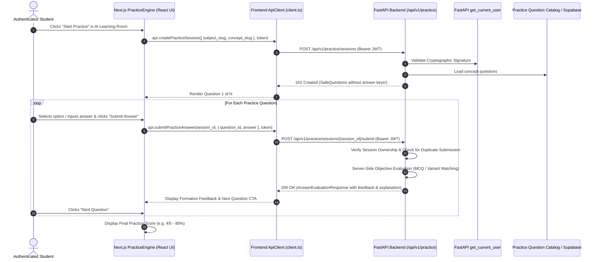

# PROOFLEARN Practice Engine Architecture & Specification

## 1. Purpose & Product Flow

The Practice Engine enables students to test their conceptual comprehension through formative, low-stakes questions immediately after learning with the Socratic AI tutor.

---

## 2. Supported Question Types (MVP)

1. **Multiple Choice (MCQ)**:
   - Evaluated by server-side exact string match against `correct_answer`.
   - Distractors designed to address common student misconceptions.
2. **Short Answer**:
   - Evaluated by server-side whitespace/case normalized matching against `correct_answer` and `accepted_variants`.
   - No dynamic code execution (`eval()` or `exec()`).

---

## 3. Answer-Key Security Invariants

- **Strict Omission**: Correct answers and pedagogical explanations are **NEVER** sent to the client upon session creation (`SafeQuestion` payload contains only `id`, `question_type`, `question_text`, `options`, `difficulty`, and `order_index`).
- **Server Evaluation**: Scoring is exclusively calculated on the authoritative FastAPI backend. Client-supplied scores are discarded.
- **IDOR Protection**: Practice sessions are isolated to the authenticated user (`session.user_id === current_user.id`). Foreign session access returns `403 Forbidden`.
- **Anti-Spam & Duplicate Defense**: Submitting an answer to an already answered question returns `409 Conflict` (`ALREADY_ANSWERED`).

---

## 4. Practice vs Proof Mode Boundary

> [!IMPORTANT]
> **Practice is NOT Proof Mode**.
> Practice provides formative feedback and explanation after every question.
> Practice scores do **NOT** count as verifiable Learning Evidence and do **NOT** issue LEI scores.
> Proof Mode will be unlocked in Task 11.
