# PROOFLEARN Proof Mode Architecture & Specification

## 1. Product Purpose & Philosophy

> "AI should help students learn, not replace their ability to think."

**Proof Mode** is the foundational product innovation of PROOFLEARN. While normal learning utilizes a Socratic AI Tutor and Practice Mode delivers immediate formative feedback, Proof Mode establishes an authoritative verification boundary where **AI assistance is strictly disabled on the server**. The student must independently solve and explain a conceptual challenge in their own words.

```mermaid
sequenceDiagram
    autonumber
    actor Student as Authenticated Student
    participant UI as Next.js ProofModeRoom
    participant Client as Frontend ApiClient (client.ts)
    participant FastAPI as FastAPI Backend (/api/v1/proof)
    participant ProofGuard as Proof Guard (proof_guard.py)
    participant AIRouter as AI Tutoring Router (/api/v1/ai/learn)

    Note over Student,FastAPI: Student Enters Proof Mode
    Student->>UI: Clicks "Prove I Learned It" -> "Start Independent Proof"
    UI->>Client: api.createProofSession({ subject_slug, concept_slug }, token)
    Client->>FastAPI: POST /api/v1/proof/sessions (Bearer JWT)
    FastAPI->>ProofGuard: create_proof_session(user_id, concept)
    ProofGuard-->>FastAPI: Session LOCKED (status="active")
    FastAPI-->>Client: 201 Created (ProofSessionResponse with challenge)
    Client-->>UI: Render Independent Challenge (Zero AI UI)

    rect rgb(60, 20, 20)
        Note over Student,AIRouter: Attempting AI Assistance During Proof Mode
        Student->>Client: Direct API / DevTools POST /api/v1/ai/learn
        Client->>FastAPI: POST /api/v1/ai/learn (Bearer JWT)
        FastAPI->>ProofGuard: is_proof_mode_active(user_id, concept)
        ProofGuard-->>FastAPI: True (Session Active)
        FastAPI-->>Client: 403 Forbidden (AI_DISABLED_IN_PROOF_MODE)
        Note over AIRouter: AI Provider is NEVER called!
    end

    Note over Student,FastAPI: Submitting Independent Challenge
    Student->>UI: Types solution and clicks "Submit Proof"
    UI->>Client: api.submitProof(session_id, { student_answer }, token)
    Client->>FastAPI: POST /api/v1/proof/sessions/{session_id}/submit (Bearer JWT)
    FastAPI->>ProofGuard: submit_and_complete_proof(session_id, user_id)
    ProofGuard-->>FastAPI: Session COMPLETED (status="completed")
    FastAPI-->>Client: 200 OK (ProofSubmissionResponse)
    Client-->>UI: Display "Proof Attempt Recorded" Screen
    Note over FastAPI,AIRouter: AI Tutoring is now UNLOCKED
```



---

## 2. User Flow
1. **Curriculum Selection & AI Learning**: Student learns foundational principles with Socratic AI tutor on `/learn/[subjectSlug]/[conceptSlug]`.
2. **Formative Practice**: Student checks basic comprehension in Practice Mode.
3. **Proof Mode Introduction**:
   - Explicit notification explaining that AI assistance will be disabled.
   - Student initiates independent challenge (`[ Start Independent Proof ]`).
4. **Active Proof Mode**:
   - Backend initializes active session and locks AI endpoints for the user.
   - Frontend renders distraction-free challenge interface with zero AI controls.
   - Student provides thorough explanation / code design in their own words.
5. **Submission & Completion**:
   - Student submits independent challenge to `POST /api/v1/proof/sessions/{session_id}/submit`.
   - Backend records response, marks session as `completed`, and unlocks AI tutoring.

---

## 3. Proof Session Lifecycle

| State | AI Allowed? | Description | Transition Trigger |
| :--- | :--- | :--- | :--- |
| `active` | **NO (403 Forbidden)** | Student is actively solving independent challenge. | Created via `POST /api/v1/proof/sessions` |
| `completed` | **YES (200 OK)** | Challenge submitted; evidence recorded on backend. | Submitted via `POST /api/v1/proof/sessions/{id}/submit` |

---

## 4. Authentication & Zero-Trust Boundary
- All Proof Mode endpoints require valid Supabase JWT Bearer tokens verified by `Depends(get_current_user)`.
- The user identity is derived **exclusively from the cryptographic JWT signature**. Client-supplied user IDs in headers or request bodies are ignored.

---

## 5. Authorization & IDOR Protection
- Every proof session is tied to `session.user_id`.
- Requests to `GET /api/v1/proof/sessions/{id}` or `POST /api/v1/proof/sessions/{id}/submit` check that `session.user_id === current_user.id`.
- Foreign access attempts return `403 Forbidden` (`FORBIDDEN`).

---

## 6. AI Blocking Architecture (Server-Side Lockdown)

> [!CRITICAL]
> **Hiding UI buttons in the browser is NOT security**.
> Even if a student crafts direct HTTP requests using `curl`, Postman, or browser DevTools, `POST /api/v1/ai/learn` queries `is_proof_mode_active(current_user.id, subject_slug, concept_slug)` before processing.
> If an active proof session exists:
> 1. The request is immediately rejected with HTTP `403 Forbidden` (`AI_DISABLED_IN_PROOF_MODE`).
> 2. The AI router and downstream LLM (Gemini) are **never called**.
> 3. Zero LLM tokens or API credits are consumed.

---

## 7. API Endpoints

### 7.1 Enter Proof Mode
- **Endpoint**: `POST /api/v1/proof/sessions`
- **Auth**: Required (`Authorization: Bearer <token>`)
- **Request**: `{"subject_slug": "python", "concept_slug": "functions"}`
- **Response (201 Created)**:
  ```json
  {
    "session_id": "proof-322e5d69-15a6-4546-9c81-0d4e54c536e8",
    "subject_slug": "python",
    "concept_slug": "functions",
    "subject_name": "Python",
    "concept_name": "Functions",
    "challenge": {
      "id": "challenge-py-func",
      "title": "Modular Discount Calculator Design",
      "prompt": "You are building an e-commerce checkout pipeline...",
      "difficulty": "beginner"
    },
    "status": "active",
    "started_at": "2026-08-23T09:20:00Z",
    "is_completed": false
  }
  ```

### 7.2 Get Proof Session
- **Endpoint**: `GET /api/v1/proof/sessions/{session_id}`
- **Auth**: Required (`Authorization: Bearer <token>`)
- **Response (200 OK)**: Current session state with challenge metadata.

### 7.3 Submit Proof Challenge
- **Endpoint**: `POST /api/v1/proof/sessions/{session_id}/submit`
- **Auth**: Required (`Authorization: Bearer <token>`)
- **Request**:
  ```json
  {
    "student_answer": "I will define calculate_discount(subtotal, discount_percent, shipping_fee)...",
    "explanation": "Optional architectural rationale..."
  }
  ```
- **Response (200 OK)**:
  ```json
  {
    "session_id": "proof-322e5d69-15a6-4546-9c81-0d4e54c536e8",
    "status": "completed",
    "message": "Proof attempt completed successfully. Your response has been recorded for evaluation.",
    "submitted_at": "2026-08-23T09:25:00Z"
  }
  ```
- **Duplicate Prevention**: Resubmissions to a completed session return `409 Conflict` (`ALREADY_SUBMITTED`).

---

## 8. Database Structure
- **Table**: `public.proof_challenges` ([`supabase/migrations/20260823000004_proof_challenges.sql`](file:///c:/Users/varap/Downloads/PROOFLEARN/supabase/migrations/20260823000004_proof_challenges.sql))
- **Table**: `public.proof_attempts` ([`supabase/migrations/20260823000001_initial_schema.sql`](file:///c:/Users/varap/Downloads/PROOFLEARN/supabase/migrations/20260823000001_initial_schema.sql))
- Protected by Row Level Security (RLS) policies.

---

## 9. Evaluation
- Deterministic submission handling in Task 11.
- Minimum answer length validation (10 characters).
- No unapproved LLM evaluation or bias in Task 11.
- LEI score calculation is deferred to Task 13.

---

## 10. Privacy & Proctoring Non-Goals
- **No Surveillance**: PROOFLEARN does not use webcams, microphone recording, eye tracking, or proctoring plugins.
- **Privacy First**: Student responses are stored securely and never transmitted to third-party advertising or public models.
- **Accurate Claims**: PROOFLEARN guarantees that its internal AI APIs are locked down server-side, providing verifiable learning evidence within the platform environment.
