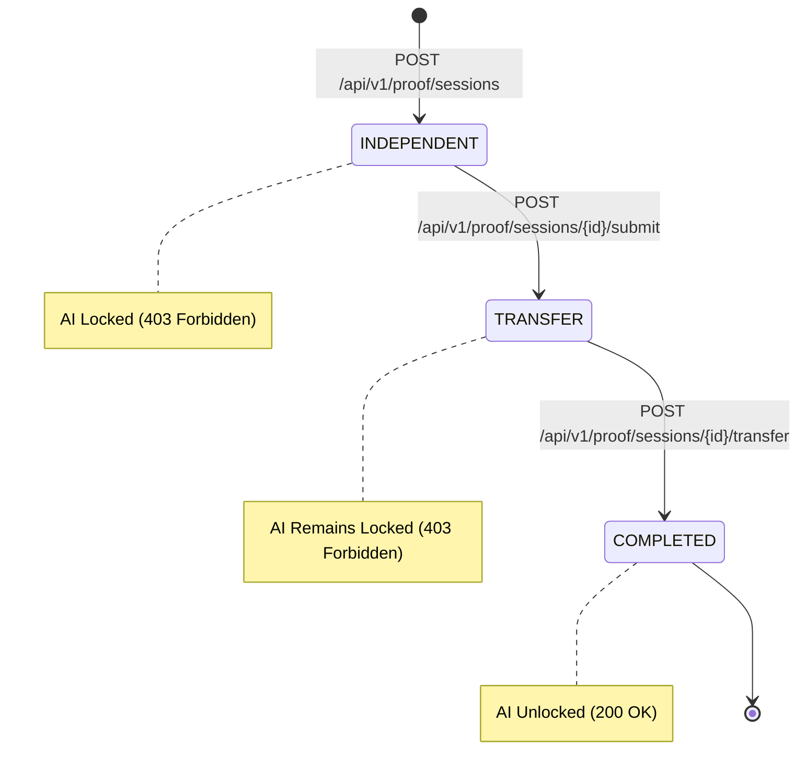

# PROOFLEARN Transfer Challenge Architecture & Specification

## 1. Core Purpose & Philosophy

> "Did the student merely remember the answer, or can they apply the concept to a completely new situation?"

The **Transfer Challenge** is Stage 2 of Proof Mode. While the initial Independent Challenge verifies recall and direct reasoning, the Transfer Challenge evaluates conceptual transfer (**Same Concept + Novel Context**).

```
Learn with AI ──► Practice ──► Enter Proof Mode ──► Stage 1: Independent Challenge ──► Stage 2: Transfer Challenge ──► Learning Evidence Ready
```

---

## 2. Transfer Principle: Same Concept + New Context

| Concept | Stage 1: Independent Context | Stage 2: Transfer Challenge Context |
| :--- | :--- | :--- |
| **Python: Functions** | E-commerce checkout discount calculator | IoT Greenhouse telemetry sensor calibration & anomaly detection |
| **Python: Variables** | Mutable lists vs. immutable tuples | High-concurrency API Gateway composite `(Method, Path)` routing keys |
| **SQL: JOINs** | Auditing unplaced customer orders | Clinical trial participant drug adherence and adverse event auditing |
| **AI/ML: Train/Test Split** | Standard feature scaling & imputation | 5M transaction financial fraud detection & temporal cross-validation |

---

## 3. Proof Mode State Machine & AI Lockdown

Transfer Challenge is executed strictly within **Proof Mode**. Therefore, the server-side AI lockdown invariant (`AI_ALLOWED = FALSE`) remains active throughout the transfer stage:



- **Order Enforcement**: Attempting to skip to the Transfer Challenge before submitting the Independent Challenge returns `400 Bad Request` (`STAGE_MISMATCH`).
- **Zero AI Leakage**: `POST /api/v1/ai/learn` returns `403 Forbidden` (`AI_DISABLED_IN_PROOF_MODE`) throughout the Transfer stage.
- **Duplicate Prevention**: Once submitted, resubmission returns `409 Conflict` (`ALREADY_SUBMITTED`).

---

## 4. API Endpoints

### 4.1 Get Transfer Challenge
- **Endpoint**: `GET /api/v1/proof/sessions/{session_id}/transfer`
- **Auth**: Required (`Authorization: Bearer <token>`)
- **Response (200 OK)**:
  ```json
  {
    "id": "transfer-py-func",
    "title": "IoT Sensor Telemetry Normalization & Alert Dispatcher",
    "scenario": "You are designing a data ingestion service for agricultural IoT sensors...",
    "prompt": "Explain how you would design modular Python functions to handle sensor conversion...",
    "difficulty": "beginner"
  }
  ```

### 4.2 Submit Transfer Challenge
- **Endpoint**: `POST /api/v1/proof/sessions/{session_id}/transfer`
- **Auth**: Required (`Authorization: Bearer <token>`)
- **Request**:
  ```json
  {
    "student_answer": "I would design convert_voltage_to_celsius(voltage, factor) and check_thresholds(temp)...",
    "explanation": "Optional design considerations..."
  }
  ```
- **Response (200 OK)**:
  ```json
  {
    "session_id": "proof-322e5d69-15a6-4546-9c81-0d4e54c536e8",
    "stage": "completed",
    "status": "completed",
    "message": "Transfer challenge submitted successfully. Your response has been recorded for evidence evaluation.",
    "submitted_at": "2026-08-23T09:30:00Z",
    "evaluation_signals": {
      "response_present": true,
      "concept_relevance": true,
      "application_attempt": true
    }
  }
  ```

---

## 5. Database Schema
- **Table**: `public.transfer_challenges` ([`supabase/migrations/20260823000005_transfer_challenges.sql`](file:///c:/Users/varap/Downloads/PROOFLEARN/supabase/migrations/20260823000005_transfer_challenges.sql))
- Protected by Row Level Security (RLS) policies.

---

## 6. Evaluation & Privacy
- **Deterministic Signals**: In Task 12, submissions are processed deterministically to capture response presence, concept relevance, and application intent without unapproved LLM evaluation.
- **No Scientific Claims**: Transfer Challenge provides prototype evidence signals for educational mastery, not psychometric or intelligence scores.
- **Next Stage (Task 13)**: The Learning Evidence Engine will combine formative practice, independent proof, and transfer signals into the Learning Evidence Index (LEI).
